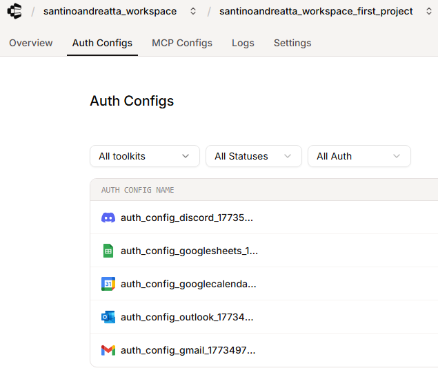
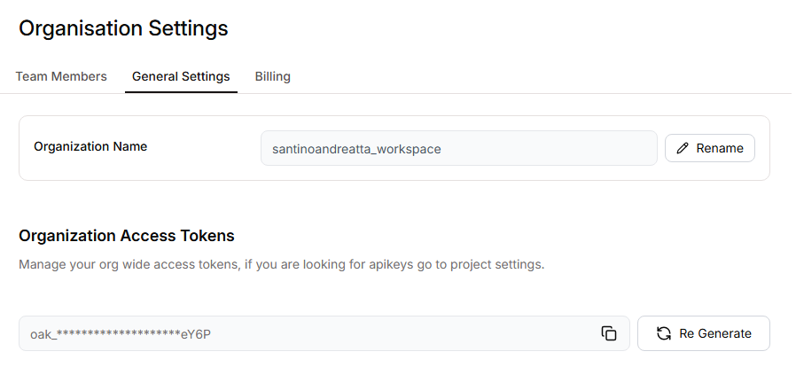

# Composio MCP Server Wrapper con OpenCode

Wrapper para el MCP Server para el uso de Composio con cualquier agente en python.

Configurable con todas los toolkits de Composio. La configuración de la toolkits se deben hacer desde tu cuenta de Composio, luego se pueden usar usando el user_id de prueba y con la api_key de tu cuenta (todo eso se encuentran en la página web de Composio en tu respectivo proyecto).

**Acá ingresando en cualquiera de esas configuraciones vas a ver tu user_id.**



**En organisation settings, general settings.**



## Instalación de dependencias

```bash
poetry install
```

## Configuración con OpenCode

En opencode.json:

```json
{
  "$schema": "https://opencode.ai/config.json",
  "mcp": {
    "el nombre que quieras": {
      "type": "local",
      "command": [
        "/root/.cache/pypoetry/virtualenvs/TU-VIRTUAL-ENV/bin/python",
        "direccion del archivo de python ejecutable del servidor"
      ]
    }
  }
}
```

## Ejecución

```bash
poetry run python mcp_composio/mcp_tools_for_opencode.py
```

## Configuración

Crear un archivo `.env` en la raíz del proyecto con las siguientes variables:

```bash
COMPOSIO_API_KEY
COMPOSIO_TEST_USER_ID
```